# Vue d'ensemble

Je suis parti du [tuto sur maker.fr expliquant commetn fabrique un CNC Roxyz](https://www.makerfr.com/cnc/roxyz/).

J'ai apporté quelques modifications à la machine pour la rendre plus compacte et rangeable.

J'ai aussi crée un chariot de rangement adapté aux dimensions de l'emplacement de rangement et à la hauteur de mon établi.

----

* Déplacement des moteurs de axes Y en face avant:
* Installation du TFT4", de l'arrêt d'urgence et dela prise d'alimentation entre les moteurs.
  
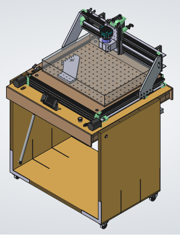

----

* Conception d'un chariot permettant de "plier" la CNC pour la ranger
* Mise en place de cales de rangement pour que l'axe des X repose sur le fond du chariot

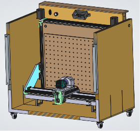
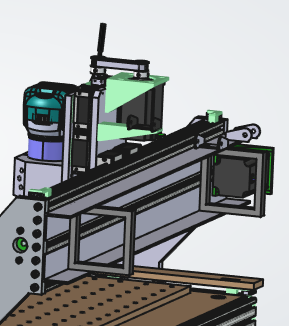

----

* Modification du berceau du moteur X et utilisation de courroie de transmission
* Modification du support de roulement pour avoir de montant du support des X identiques

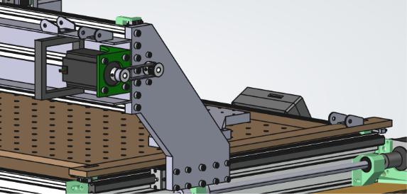  

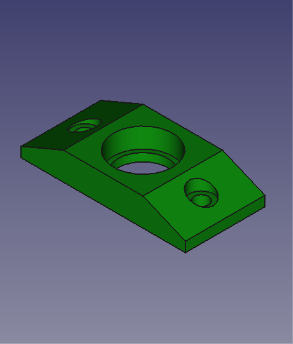
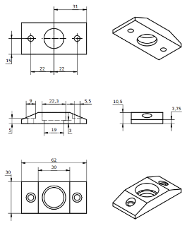  

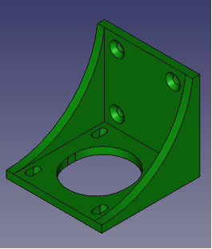
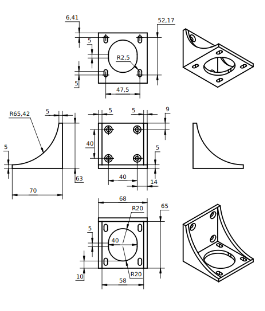

----

* Déplacement du guide câble à l'intérieur de la machine

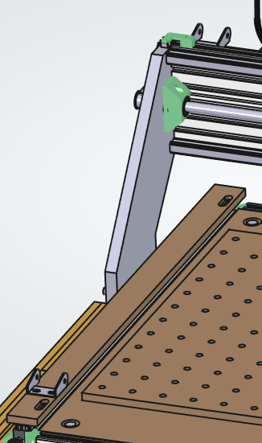

----

* Installation de l'electronique dans le plateau de support de la CNC

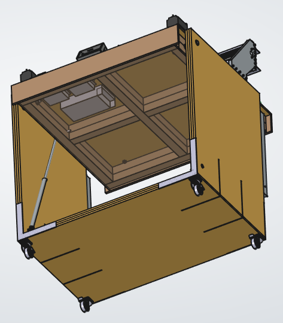

----

* Vérins pour aider l'ouverture de la table de la CNC
* Taquets de fixation du plateau en position ouverte (avec un grand bras de levier pour augmenter la rigidité)

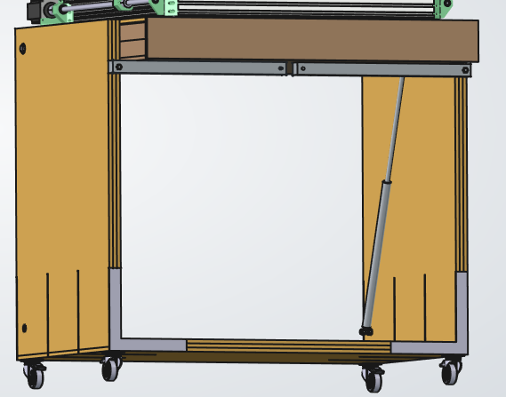